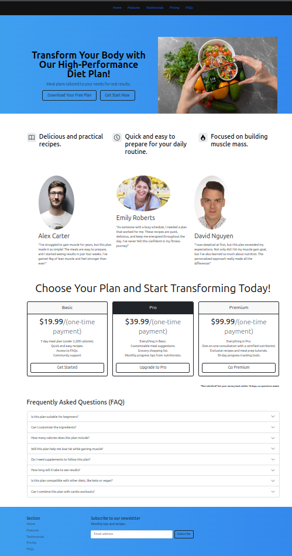

<h1 align="center">Health Recipes Web Page</h1>

Hands on project to fix the contents and concepts of the bootcamp, using bootstrap, stylization of the web page and the bootstrap components.  

  

  <a href="#-techs">Techs</a>&nbsp;&nbsp;&nbsp;|&nbsp;&nbsp;&nbsp;
  <a href="#-project">Project</a>&nbsp;&nbsp;&nbsp;|&nbsp;&nbsp;&nbsp;
  <a href="#-learning">Learning</a>&nbsp;&nbsp;&nbsp;|&nbsp;&nbsp;&nbsp;
  <a href="#-license">License</a>

  

 

## 🚀 Techs

This project was developed using:

- HTML
- CSS
- Git
- Bootstrap

## 💻 Project

Web Page that offers plans for person who wants a better and health meals.

## 📑 Learning

During the development of this web page I pratice the using of bootstrap for building faster and more responsive sites.

## 📝 License

Project is under MIT License.

---